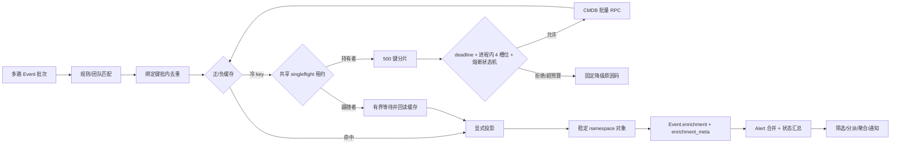

# 告警丰富运行时可靠性加固

Status: implemented — 2026-09-03 已实施并完成专项与完整链路验证

## 背景

当前告警丰富已经具备声明式规则、批内查询键去重、CMDB 批量查询、正负缓存、简单熔断、
显式投影以及 Event 到 Alert 的结果传播。但架构检查确认仍有四类问题：

1. 熔断打开期间的请求会刷新熔断 TTL，持续流量下可能无法恢复；缺少半开单探针。
2. 单批唯一查询键超过 500 时直接截断；没有整批 deadline，也没有完整的并发风暴保护。
3. namespace 冲突时会从对象变成数组，使 `enrichment.<namespace>.<field>` 路径失效。
4. `enrich_batch()` 只原地修改事件且不返回结果，无法区分未匹配、未找到、故障、熔断、
   超预算和冲突，也缺少运行指标。

本变更只加固丰富运行时，不改变“丰富失败不得阻断原始 Event 入库”的主合同。

## 实施门禁

- 本文只锁定实施方案，不代表已经实施。
- 用户明确说“实施”之前，不得修改运行时代码、模型或迁移。
- 实施时必须先补失败测试，再逐项修改，并保留现有 Event→Alert 完整链路测试。

## 总体接口

外部 seam 仍保持一个主要接口：

```python
result = EnrichmentEngine().enrich_batch(events)
```

返回值升级为：

```python
@dataclass
class EnrichmentBatchResult:
    events: list[dict]
    summary: EnrichmentSummary
    outcomes: list[RuleOutcome]
```

第一阶段保留原地修改 `events` 的兼容行为，同时要求新调用方使用返回结果；待全部调用方完成
迁移后，再单独决策是否移除隐藏副作用。熔断、分块、在途合并、冲突合并和遥测均属于引擎
内部 seam，接入 Adapter 不感知其实现细节。

## 方案一：熔断状态机

### 状态合同

```text
closed --连续 provider 失败达到阈值--> open
open   --到达 retry_at--------------> half-open
half-open --唯一探测成功------------> closed
half-open --唯一探测失败------------> open(new retry_at)
```

- `not_found`、规则未命中和绑定缺失不计入 provider 失败。
- open 窗口内普通请求只降级，绝不更新 `retry_at` 或缓存 TTL。
- 到达 `retry_at` 后通过共享缓存的原子 `add(probe_key, token)` 争抢唯一探测权。
- 未取得探测权的请求继续降级，不向 CMDB 发请求。
- 探测成功清除熔断状态和连续失败计数；探测失败才设置新的 30 秒窗口。
- 熔断 scope 包含 provider 类型、标准化 provider 配置和授权团队，防止组织间互相影响。
- 状态读写、时钟和探针租约封装在 `enrichment/circuit_breaker.py`，测试使用可控时钟。

### 验收

- open 窗口内连续请求不会延长窗口。
- 窗口到期后 10 个并发请求最多产生一个半开 CMDB 探测。
- 探测成功关闭熔断；失败重新打开；not_found 不触发熔断。

## 方案二：分块、总预算和并发风暴保护

### 当前并发语义

- 同一次 `create_events()` 收到的 Event 会作为一个列表进入引擎。
- 同一规则、同一授权团队、相同绑定键在批内只保留一个查询键，多个 Event 共享结果。
- CMDB Provider 会按 `model_id + lookup_type` 组成批量 RPC，而不是每个 Event 一次 RPC。
- 当前不同规则顺序执行，Provider 内不同模型分组也顺序执行。
- 但跨 HTTP/NATS 请求、跨 Worker、跨进程没有在途请求合并或全局并发闸门；多个冷缓存批次
  可以同时查询相同 CMDB 资源。因此当前只能防止“单批 N+1”，不能完全防止并发风暴。

### 分块与 deadline

```text
MAX_KEYS_PER_PROVIDER_CALL = 500
DEFAULT_BATCH_BUDGET_SECONDS = 5
MAX_BATCH_BUDGET_SECONDS = 10
MAX_PARALLEL_PROVIDER_CALLS_PER_PROCESS = 4
```

- 唯一键按 500 分块，例如 1201 个键必须形成 500/500/201，禁止直接截断。
- 引擎进入时使用单调时钟创建统一 deadline；每个分块和模型分组开始前检查剩余时间。
- 单次 RPC timeout 取规则超时与剩余预算的较小值。
- 到达总预算后，未开始的键标记为 `budget_exhausted`，不写负缓存。
- CMDB 模型分组允许有界并行，单进程同时在途物理查询不超过 4。

### 同键在途合并（singleflight）

- singleflight 键与结果缓存键使用同一身份：provider、标准化配置、授权团队和绑定键。
- 对每个冷缓存键使用共享 Redis/cache 的原子 `add` 获取带 token 的短租约。
- 当前批次只查询取得租约的键，并继续按模型批量发送；未取得租约的相同键不得重复查询。
- 失败方可在剩余 deadline 内有界等待并重新读取结果缓存；等待到期则以
  `inflight_coalesced` 降级，原 Event 继续入库。
- 释放租约时校验 token，禁止误删其他进程续接的租约；租约时间必须覆盖 RPC timeout 并有
  很小安全余量，进程崩溃后可自动释放。
- 如果部署使用进程本地缓存，只能提供进程内合并；生产环境要获得跨 Worker 保证，必须使用
  共享 Redis 等支持原子 `add` 的后端。

### 异键并发闸门

- singleflight 只解决“相同资源”冷缓存击穿，不解决大量不同资源同时到达。
- 每个进程使用最大 4 个 Provider 槽位；槽位耗尽且无法在 deadline 内取得时直接标记
  `provider_saturated`，不得无限排队。
- 是否增加集群级共享信号量以及具体额度，必须根据 CMDB 容量和生产 P95/P99 数据锁定；
  第一阶段不得凭经验写死一个未经验证的集群额度。
- 熔断负责失败保护，槽位负责并发上限，singleflight 负责同键合并，三者不可互相替代。

### 验收

- 1201 个不同键完整形成 500/500/201，成功块不受失败块影响。
- 同批 1000 个 Event 指向一个资源时只产生一个物理查询键。
- 多进程同时冷查相同键时只有租约持有者调用 CMDB。
- 不同键压力测试中单进程物理查询峰值不超过 4，总耗时受 batch deadline 约束。
- `budget_exhausted`、`inflight_coalesced`、`provider_saturated` 均不进入负缓存。

## 方案三：稳定 namespace 结构

业务字段继续直接位于 namespace 下，保留现有路径，不引入破坏性的 `data` 包装层：

```json
{
  "cmdb": {
    "owner": "alice",
    "business_system": "payment",
    "_meta": {
      "schema_version": 1,
      "status": "conflict",
      "rule_ids": [12, 18],
      "conflicts": {"owner": ["bob"]}
    }
  }
}
```

- namespace 永远是对象，不再在对象和数组间切换。
- `enrichment.cmdb.owner` 继续返回稳定主值。
- 同一 Event 按 rule ID 升序、Event→Alert 按 Event 主键升序选择首个主值。
- 其余不同值去重写入 `_meta.conflicts`，每字段最多保留 20 项。
- 投影别名禁止以 `_` 开头，普通下游路径禁止访问 `_meta`。
- 合并规则收敛到 `enrichment/merge.py`，引擎和 AlertBuilder 共用，禁止各自实现。

历史数组结构采用双读、单写和后台迁移：先兼容读取，新数据只写稳定对象，再用幂等分页命令
转换旧 Event/Alert。不得在数据库 schema migration 或服务启动期全表重写历史 JSON。

### 验收

- 正常、同值和冲突场景下 namespace 均为对象。
- 冲突后详情、筛选、分派和聚合仍可读取原有字段路径。
- 旧数组可以读，并能由后台命令断点续跑转换；冲突元数据有界且不含 Provider payload。

## 方案四：结果状态和运行指标

固定原因码：

```text
success, cache_hit, not_found, team_mismatch, rule_unmatched,
missing_binding, provider_failed, circuit_open, budget_exhausted,
inflight_coalesced, provider_saturated, projection_empty, conflict
```

- 批结果至少汇总 received、enriched、not_found、failed、circuit_open、budget_exhausted、
  inflight_coalesced、provider_saturated、conflict 和 duration_ms。
- `rule_unmatched` 等高频明细只做汇总，不能为每个 Event×Rule 生成无界 outcomes。
- 如需单告警诊断，在 Event 增加独立且有界的 `enrichment_meta`；只保存固定状态码、rule ID、
  namespace 和时间，不保存异常正文、资源 payload 或凭据。
- Alert 只保存成员 Event 的聚合摘要，不复制全部诊断明细。

运行指标至少包括：

```text
alert_enrichment_attempt_total{provider,status}
alert_enrichment_event_total{result}
alert_enrichment_cache_total{provider,result}
alert_enrichment_provider_duration_seconds{provider}
alert_enrichment_batch_duration_seconds
alert_enrichment_circuit_transition_total{provider,to_state}
alert_enrichment_budget_exhausted_total{provider}
alert_enrichment_conflict_total{provider}
```

指标标签不得包含 event_id、resource_id、CMDB 实例名、异常正文或用户输入的 namespace。
每批只记录一条有界终态汇总；一个 Provider 失败只由持有该失败的调用边界记录 traceback。

### 验收

- 每个降级分支都能得到唯一、稳定的 reason code。
- 指标计数与批结果一致，失败不重复计数。
- 日志、指标和 `enrichment_meta` 不包含测试哨兵 payload 或凭据。
- 对旧调用方保持兼容，Event 入库不因结果收集或遥测失败而中断。

## 实施顺序

1. 新增批结果、固定状态枚举和失败测试，暂不改变数据结构。
2. 修复熔断状态机和半开单探针。
3. 增加分块、统一 deadline、singleflight 和单进程 Provider 槽位。
4. 增加统一 merge 模块和 namespace `_meta`，所有下游双读。
5. 增加运行指标以及可选的 `enrichment_meta` 持久化。
6. 后台转换历史数组数据；观察期结束后删除旧结构兼容。
7. 运行丰富专项、接入到 Alert 的完整链路测试及 alerts 全量回归。

## 非目标

- 本变更不把丰富整体改成异步任务，也不改变“丰富发生在 Event 收敛前”的产品语义。
- 不因丰富失败重试或拒绝原始告警。
- 不记录或展示 CMDB 完整响应。
- 不在没有容量证据时写死集群级 CMDB 并发额度。

## 实施结果



落地映射：

- `enrichment/circuit_breaker.py`：closed/open/half-open 状态机、固定 `retry_at`、共享单探针。
- `enrichment/engine.py`：500 键分片、5 秒整批预算、同键 singleflight、单进程 4 个 Provider 槽位、批结果与固定原因码。
- `enrichment/merge.py`：稳定对象合并、每字段最多 20 个冲突值、历史数组归一化。
- `enrichment/telemetry.py`：低基数批次、缓存和 Provider 运行计数；规则 metrics API 暴露 runtime 摘要。
- `Event.enrichment_meta` 与 `Alert.enrichment_meta`：分别保存有界诊断和成员事件状态汇总；迁移为 `0029_alert_event_enrichment_meta.py`。
- `normalize_alert_enrichment`：支持 dry-run、批大小和主键游标续跑的历史数据转换命令。
- 筛选、分派规则、聚合 SQL、详情与通知对历史数组双读；新写入只产生稳定对象。

运行条件：跨 Worker 的 singleflight 和半开单探针依赖支持原子 `add` 的共享缓存。生产环境应配置
`REDIS_CACHE_URL`；若回退到 LocMemCache，只能保证单进程内语义。进程内 Provider 槽位始终生效，
集群级额度仍需依据 CMDB 容量数据另行锁定。

验证证据：

- 丰富及相关链路专项：141 passed。
- 历史转换命令：2 passed（dry-run、幂等、主键断点续跑）。
- alerts 全量（SQLite 当前模型、禁用历史迁移）：1419 passed，6 个既有基线失败；失败集中于
  NATS 统计、权限查询数、SQLite 并发锁和升级 BDD，与本变更无关。
- Web 告警详情相关测试：8 passed。
- Django system check 与 `makemigrations --check --dry-run`：通过。
- 标准 SQLite 历史迁移链仍会在本变更之前的旧迁移处失败：
  `NewSessionEventRelation has no field named 'event'`；本次未越界修改该既有迁移。
