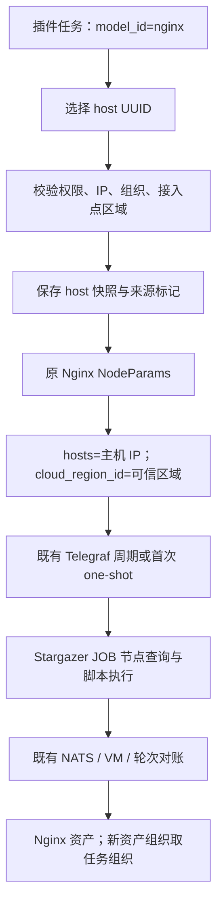

# CMDB：JOB 选择主机发现——实施设计

Status: implemented — 用户已确认并授权实施；代码完成，验证结果见 validation.md

日期：2026-09-21

需求依据：[需求文档](spec.md)。实施前重新核对工作区差异，保留其他任务改动。用户后续已明确授权实施；实际完成情况和测试边界见 [实施与验证记录](validation.md)。

## 1. 设计结论

将「主机发现」接入已有任务配置和目标快照：任务继续确定采集插件，主机提供执行 IP。新增少量来源信息与校验，不新增采集引擎、调度服务或通用目标框架。

本次必须区分两个身份：

- **来源主机身份：**`instances[].inst_uuid`，用于可信目标解析和页面回显。
- **发现资源身份：**由原插件输出和既有 CMDB 对账规则确定，不使用来源主机 UUID。

「选择资产仅更新所选资产」只记录后续事项，本次不实施结果过滤或定向 UUID 回写。

## 2. 当前链路与证据

本节保留方案确认时的代码阅读基线；实施后的差异及验证见 validation.md。尚未进行真实主机环境测试。路径相对仓库根目录。

| 环节 | 当前行为 | 代码入口 |
| --- | --- | --- |
| 页面目标 | `collectionType` 为 ip/asset；资产默认按插件模型查询 | `web/src/app/cmdb/(pages)/assetManage/autoDiscovery/collection/profess/components/baseTask.tsx` |
| 提交与回显 | `HostTask` 提交 IP 或实例；空 IP 时回显为 asset | 同目录 `hostTask.tsx`、`../hooks/formatTaskValues.ts` |
| 请求转换 | `format_params` 已保留显式空 `ip_range`，但仍忽略空 `instances` | `server/apps/cmdb/services/collect_service.py` |
| 身份校验 | UUID 查询真实实例、验证可见性、生成白名单快照；部分目录限定目标模型 | `server/apps/cmdb/serializers/collect_serializer.py` |
| 插件选择 | 按任务 `model_id` 和 `driver_type` 选择 NodeParams | `server/apps/cmdb/node_configs/config_factory.py` |
| 目标与配置 | `get_hosts` 拼接实例 `ip_addr`；SSH mixin 生成 JOB 参数 | `server/apps/cmdb/node_configs/base.py`、`ssh/base.py` |
| 首次触发 | 提交后下发配置，再通过既有 Telegraf one-shot 编排触发 | `server/apps/cmdb/services/first_collection_orchestrator.py`、`first_collection_policy.py` |
| 周期触发 | 接入点 Telegraf 调用 Stargazer，运行时按 IP 构建目标 | `agents/stargazer/core/collection/request_builder.py` |
| 节点定位 | JOB lookup 已消费 `cloud_region_id`，按任务组织查询节点 | `agents/stargazer/core/collection/plugins.py`、`service/node_info_loader.py`；`server/apps/node_mgmt/nats/node.py::get_nodes_by_ips` |
| 脚本执行 | 有 `node_info` 走目标节点 local；无则经接入点 SSH | `agents/stargazer/plugins/script_executor.py` |
| 对账入口 | JOB 结果经 VM 轮次对账，插件仍按任务模型选择 | `server/apps/cmdb/tasks/celery_tasks.py`、`collection/collect_tasks/job_collect.py` |
| 组织与身份 | 单实例优先取来源实例组织和名称；多实例取任务组织 | `server/apps/cmdb/collection/collect_tasks/base.py::format_params` |
| 资产对账 | 依据结果模型、实例名和任务归属，处理接管冲突与清理 | `server/apps/cmdb/collection/metrics_cannula.py`、`collection/common.py` |

特别注意：`CollectTargetService` 存在标准目标表示，但当前通用 JOB 下发实际走 `BaseNodeParams.get_hosts()`。不要只修改该目标辅助类就认为执行链路已接通。

参考架构：[CMDB 现状分析](../../../docs/design-docs/cmdb-module-architecture-analysis.md)、[现状结构](../../../docs/design-docs/cmdb-current.architecture.json)、[核心流程](../../../docs/design-docs/cmdb-core-vertical.workflow.json)。实现以当前代码为准；现有图中概括性的首次触发入口不能替代 one-shot 编排事实。

## 3. 方案选择

| 方案 | 结果 | 取舍 |
| --- | --- | --- |
| 前端将选中主机 IP 填入 `ip_range` | 能执行，但丢失主机来源与 UUID，无法可靠回显及服务端按资产验证 | 不采用 |
| 直接把 host 快照写入 `instances`，不保存来源 | 执行可复用，但编辑回显、企业目标模型限制、单实例入库语义无法准确区分 | 不采用 |
| 来源标记 + 可信主机快照 | 利用现有数据结构，明确执行目标与发现结果的差异 | 采用 |
| 每轮按 UUID 动态解析主机并重推配置 | 支持动态跟随，但改变持久配置与周期执行机制 | 本次不采用 |

## 4. 数据与兼容契约

### 4.1 任务参数

在适用入口使用 `params.target_source`：`ip`、`asset`、`host`。该字段不改变 `input_method`；后者表示结果入库方式，不是目标来源。

新主机模式的示意请求（仅展示相关字段，UUID 与地址均为示例）：

```json
{
  "model_id": "nginx",
  "driver_type": "job",
  "task_type": "middleware",
  "ip_range": "",
  "instances": [
    {"inst_uuid": "63e4a531-b6bb-43cc-9eae-8eb8a09f795e"}
  ],
  "params": {
    "target_source": "host",
    "ip_precheck": false
  }
}
```

服务端通过 UUID 获取真实 `model_id=host`、`ip_addr`、名称、组织与区域，生成现有白名单快照。使用 `params.target_cloud_region_id` 保存服务端确认的接入点区域；客户端提交的同名值不能作为依据。

| 来源 | `ip_range` | `instances` | 区域字段 |
| --- | --- | --- | --- |
| host | 空 | 非空可信 host 快照 | 服务端生成 `target_cloud_region_id` |
| ip | 现有 IP 输入 | 显式空列表 | 删除新主机模式专属区域字段 |
| asset | 空 | 原模型资产快照 | 删除新主机模式专属区域字段，保留原逻辑 |

不在 `params` 再保存一份主机 UUID/IP 列表。无需 migration。

### 4.2 旧任务与更新

- 无 `target_source` 的旧任务按既有 `ip_range`/`instances` 规则解释，不批量迁移。
- 新 UI 对适用入口提交明确来源；不从所选实例 `model_id=host` 猜测用户意图。
- PATCH 未提交目标字段时保留原值；显式提交空列表时必须真正清空。完整表单切换模式时同时提交来源及两个目标字段。
- `params` 更新保留合法的其他任务参数和既有服务端字段处理，例如偏移、凭据版本；不得为了来源标记覆盖整份 params。
- 修改接入点、组织、目标、来源时使用合并后的有效状态重新验证；不能因为 PATCH 没有 `instances` 就跳过新模式校验。
- 重新提交目标时刷新可信快照；周期触发与手工读取既有配置不新增主机资产查询。
- 新旧模式互转不自动迁移资产所有权；改变发现范围后按原清理策略处理本任务资产，不引入额外清理规则。

## 5. 前端实施

### 5.1 插件准入

由服务端有效采集目录统一产生 `supports_host_discovery`，前端只消费，不维护另一份插件名单。规则对应需求第 3 节：

- 真实目录驱动为 job，任务类型为 db/middleware；或 `physcial_server` 的 job 入口。
- host/config_file/pc/hmc、FC 专用入口、非 JOB 不增加第三种选择。
- 校验以目录的实际元数据为准，不能相信请求自报的 driver/task_type 获得准入。

只增加一个能力位，不设计动态表单 Schema 或运行时注册框架。

### 5.2 选择与回显

在 `baseTask.tsx` 将来源类型收敛为 `'ip' | 'asset' | 'host'`，主机模式查询固定模型 `host`。首次查询、翻页、重新打开必须使用同一个有效查询模型；不能首次查 host、翻页又退回插件模型。

主机模式复用现有资产搜索接口、分页表格、云区域查询条件和组织筛选能力，不新增跨模型查询接口。任务组织筛选必须落实到服务端搜索条件，不能只在当前页结果中过滤后伪造总数。

跨页合并按 UUID 与当前可见页进行增删。已有 `networkAssetSelection.ts` 具有类似行为；优先复用可独立表达的纯函数。若提取通用分页选择函数，保持 app-local 且同时测试 Network 和主机两个真实调用方，不提升为跨应用共享框架。

`HostTask` 提交来源和 UUID，编辑／复制按来源回显。详情组件展示来源及保存快照。保持原任务模型、插件信息、凭据和周期配置。

所有新文案进入中英文 locale；布局复用 AntD、CustomTable 和 Tailwind，保留共享控件宽度常量，不新建普通布局 SCSS 或硬编码颜色。旧资产模式不显示「仅更新所选资产」的已实现承诺。

## 6. Server 目标校验与保存

建议新增一个小型 app-local 模块 `services/job_host_discovery_policy.py`，集中表达准入、来源和可信快照的校验规则；外部查询仍由现有服务／序列化器组织。不建立通用目标解析框架。

保存顺序：

1. 读取请求与已有任务的有效状态，保留现有任务权限检查。
2. 依据真实插件目录判断主机模式是否允许；拒绝未知来源值与不支持的组合。
3. 先验证目标列表结构、数量（建议上限 2048）、UUID；再执行有界批量查询。沿用现有 UUID 解析、权限判断，不逐台 RPC。
4. 复用 `_query_authorized_instances` 查询 host；要求每个 UUID 存在、可见且真实模型为 host。新模式不受企业目录原 `target_model_id=<插件模型>` 限制；其他来源继续使用原模型校验。
5. 验证每个 host 的合法 `ip_addr`、区域及与任务组织的交集，拒绝重复 IP。只按规范化 IP 比较，不从名称推导或随意取网卡列表地址。
6. 通过现有 `NodeMgmt.get_authorized_nodes_by_ids` 带真实请求权限上下文验证接入点，随后通过 `get_nodes_by_ids` 获取其区域元数据。前者当前不返回区域，不能误用其响应字段。两步只查询已授权 ID，核验它是当前允许的接入点类型及任务组织范围。
7. 所选主机区域必须与接入点区域一致；缺失区域、查询失败或无法确认权限时拒绝新模式保存，不回退为全区域查询。保存服务端区域快照。
8. 沿现有事务保存任务；事务提交后复用配置同步与首次采集编排。

不使用前端 access_point 快照中的区域作为最终事实。现有 `_resolve_host_cloud_meta` 优先读取客户端快照，不能直接把该行为当成新模式的可信校验。

### 6.1 必须随模式切换修复的空值问题

`CollectModelService.format_params()` 当前只有显式空 `ip_range` 会保留，空 `instances` 会被 `if data.get(key)` 丢弃。编辑 host → ip 时，旧 instances 可能留在任务中，且 `get_hosts()` 优先使用它。

修复限定为目标字段的「未提交」与「显式清空」区分，不泛化改写所有可选字段。测试必须从更新入口验证最终保存状态及生成的 hosts，不能只测试前端 payload。

## 7. 下发与执行



- NodeParams 工厂继续使用任务模型；不以 `instances[].model_id` 选择插件。
- 复用 `get_hosts()` 输出主机 IP；在新主机模式为 JOB 配置增加 `cloud_region_id`，值来自服务端保存的 `target_cloud_region_id`，不来自表单直接赋值。
- 多凭据路径和单凭据路径都要保留任务级区域；不能让凭据字段剥离步骤吞掉区域参数。
- Stargazer 已支持 `cloud_region_id` 进入 `RunNodeInfoLookup`；NodeMgmt 既有查询支持组织与区域过滤，原则上不改 Agent 脚本或查询协议。
- 区域只改变本次新增模式的目标定位；旧 IP/asset 任务不批量改变节点查询行为。
- 保留现有本地／SSH 路由及失败回退。未安装、离线或不匹配的 Agent 不因主机存在就被视为可用；本次不新增 Agent 健康检查或改变其路由策略。
- 不改并发、目标超时、脚本执行上限、凭据重试、预检及取消机制。
- 首次采集 fingerprint 已包含 instances、ip_range、access_point、params；验证目标变更经过既有配置先行和幂等触发流程，无需再建调度链。

## 8. 结果入库的最小调整

在 `BaseCollect.format_params()` 对新主机模式单独处理：

- 采集插件模型取任务 `model_id`；
- 组织取任务 `team`；
- 不把单台来源主机的 `inst_name` 或内部图 ID 传作发现资源身份，返回该位置的空值；
- 其他模式维持原逻辑。

后续 `MetricsCannula`、插件映射、`Management` 继续原对账规则。验证新资源按任务组织新增，既有资产保留原组织；其他任务占有的资产仍报告冲突。不得以来源主机 UUID 强行接管。

Nginx 脚本可返回多个记录，按插件输出处理；多网卡输出 IP、自动主机关联、按选中资产 UUID 更新不在本次修改范围。

清理行为沿用完整快照约束。需验证部分采集或发布失败不扩大清理，来源 host 不进入 Nginx 清理集合。当前空结果及轮次标记如出现基线缺陷，应明确记录，不以本功能顺带重构结果发布链。

## 9. 预计文件范围

| 范围 | 文件／位置 | 目的 |
| --- | --- | --- |
| 前端 | `collection/profess/components/baseTask.tsx` | 新来源、主机查询、分页选择、切换清空 |
| 前端 | 同目录 `hostTask.tsx`、`taskDetail.tsx` | 提交、编辑复制、详情 |
| 前端 | `collection/profess/hooks/formatTaskValues.ts`、相关类型及 locale | params 保留、来源类型、中英文 |
| 前端 | app-local 目标选择纯函数及测试 | 跨页合并、重复目标、上限 |
| Server | `services/job_host_discovery_policy.py`（拟新增） | 新模式的紧凑业务规则 |
| Server | `services/collect_object_tree.py` | 暴露统一准入能力 |
| Server | `serializers/collect_serializer.py` | 可信目标、模型、组织和区域校验 |
| Server | `services/collect_service.py` | 显式清空与服务端元数据编排 |
| Server | `node_configs/base.py` 或 `node_configs/ssh/base.py` 的实际参数组装位置 | 仅新模式传递区域 |
| Server | `collection/collect_tasks/base.py` | 来源主机不覆盖结果身份与组织 |
| 测试 | CMDB、Web、Stargazer 已有相关测试及新增用例 | 外部行为与协议回归 |
| 架构文档 | 已有 CMDB 报告及相关图件受影响片段 | 实施后同步目标来源与数据流事实，不重画无关模块 |

原则上无需修改 NodeMgmt／Stargazer 生产代码、插件脚本、数据库模型、部署与启动配置。若验证证明既有 Interface 不足，先在本计划记录具体缺口和范围变化，再决定扩展，不把假设写成已完成事实。

## 10. 分步实施与验收映射

已按行为测试先行完成 T1–T4，以及 T5 的配置、首次采集、路由和已有对账回归。T6 的文档更新已完成，真实设备验收尚未执行；不将自动化替身测试表述为真实环境通过。

| 步骤 | 工作 | 完成条件 |
| --- | --- | --- |
| T1 | 锁定目录准入与来源参数；添加策略和序列化测试 | 非 JOB、专用入口拒绝；社区和企业普通 JOB 可用；AC-05/13/14 |
| T2 | 实现可信快照、接入点权限与区域、显式清空 | 越权和伪造请求无下发；host→ip 不残留；AC-05/06/10/11 |
| T3 | 接通节点配置区域及新模式入库参数 | 插件仍正确；单／多主机组织一致；AC-01/02/06/08 |
| T4 | 前端选择、跨页、编辑复制和详情 | AC-04/09/10；Network 等共用表单不回退 |
| T5 | 首次／周期配置、路由、幂等和失败回归 | AC-07/12/13；凭据与轮次行为不变 |
| T6 | 隔离测试环境端到端、文档更新、评审 | Nginx 两实例真实发现证据；所有必需验证通过或明确阻断 |

## 11. 验证设计

### 11.1 自动化行为测试

1. **目录和权限：**以真实合并目录验证支持范围；两个不同组织用户互不可选对方 host；伪造 IP、模型或区域不能覆盖可信记录；接入点权限不足时无下发。
2. **目标合法性：**非法 UUID、删除主机、非 host、无 IP、重复 IP、未知区域、不同区域、任务组织不匹配、2048/2049 边界；校验失败不产生任务或外部配置。
3. **模式切换：**host→ip、host→asset、ip/asset→host；显式空列表真正落库；PATCH 未提交目标时保留；其他 params 不丢失。
4. **企业兼容：**企业目录默认 `target_model_id` 为自身模型；host 模式按 host 验证，asset 模式仍按原模型验证。
5. **最终下发配置：**任务 nginx + 两个 host，hosts 是两个主机 IP，plugin/model/tag 仍属 nginx；可信区域完整进入单／多凭据配置；没有泄露凭据。
6. **路由：**同 IP 两区域只查询指定区域；单个符合范围的 node_info 命中目标 local；无命中走原 SSH；查询歧义／失败行为保持原契约。
7. **入库：**一台与多台来源主机组织不同，新增 Nginx 均取任务组织；UUID 不混用；重复采集不重复创建；其他任务占有资产不被接管。
8. **结果完整性：**一台主机两个 Nginx、无 Nginx、部分目标失败、上报失败；不伪造资产、不删除来源 host、不绕过原清理保护。
9. **首次采集与补偿：**目标变更影响既有 fingerprint，配置下发成功后才允许首次触发；下发失败保留原补偿语义，不新增启动依赖。
10. **前端交互：**真实操作切换来源、翻页勾选、删除、更换组织／接入点、保存、编辑、复制；不能只断言源代码包含某个字符串。

优先复用当前测试入口：`test_collect_instance_uuid_contract.py`、`test_collect_service_methods.py`、`test_collect_service_permission_and_node_params.py`、`test_first_collection_orchestrator.py`、`test_collect_service_first_collection.py`、Stargazer 的 `test_job_node_info_loader.py` 与相关路由测试。新增测试具体文件名随落点确定。

方案确认时拟定的运行命令（实际命令与结果见 validation.md）：

```bash
cd server
DB_ENGINE=sqlite DB_NAME=:memory: SECRET_KEY=cursor-cloud-dev ENABLE_CELERY=true uv run pytest apps/cmdb/tests/test_job_host_discovery_policy.py apps/cmdb/tests/test_job_host_discovery_serializer.py apps/cmdb/tests/test_job_host_discovery_pipeline.py apps/cmdb/tests/test_collect_instance_uuid_contract.py apps/cmdb/tests/test_collect_service_permission_and_node_params.py apps/cmdb/tests/test_collect_service_first_collection.py --no-cov
```

前三个测试文件已新增。随后按实际触及的共享逻辑运行对应既有回归；Web 跑相关 Vitest、`pnpm lint` 和 `pnpm type-check`，并完成仓库要求的质量门禁。运行环境缺失或基线失败要保留原始证据，不为单测启动整套中间件。

### 11.2 真实链路验收

使用授权的隔离测试主机：至少一台走 Agent、一台走 SSH；准备一个主机上两个可区分的 Nginx 实例，以及一个无 Nginx 的目标。

从页面新建主机发现任务，验证保存快照、实际下发配置、命中执行节点、脚本输出和最终 CMDB 资产。重复执行验证无重复资产；变更任务目标后确认配置更新；不同区域同 IP 用路由集成测试或隔离网络验证，不向未知生产主机发起采集。

Nginx 真实链路通过不能替代所有插件的真实设备验证；其他适用插件至少完成最终配置契约测试，明确记录未实测项。

## 12. 发布与回退

- 无数据库迁移。先确保后端支持新来源与可信区域，再启用对应前端；既有任务不迁移、不批量重新下发。
- 确认部署的 Stargazer 版本具有已核对的区域查询能力；旧版本缺少该能力时不得启用新模式，不做静默兼容。
- 回退前暂停／停用新主机模式任务，并沿现有机制撤销或停用对应采集配置，确认停止触发；仅隐藏页面入口不能停止既有 Telegraf 任务。
- 不将新任务直接交给无法识别来源的旧 UI 编辑；也不批量改成 IP 任务作为回退。
- 对原资产的发现写入不执行盲目逆向删除；如需业务数据回退，依据现有变更记录和明确范围单独处理。

## 13. 文档阶段检查与待确认

已完成：读取当前页面、保存、目录、目标配置、执行、对账代码及相关规范；提出设计。未完成：任何业务代码修改、自动化功能测试或真实采集验收。

产品新增细化取舍统一见 [需求文档第 9 节](spec.md#9-本次文档确认内容)。确认后按 T1—T6 实施；若用户要求将已有资产定向更新并入，须先补齐其独立身份匹配与结果处理设计，不能只增加一个模式字段即宣称完成。
