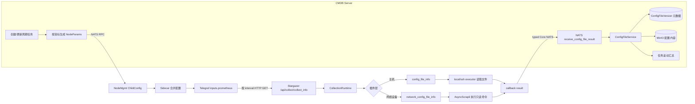

# 配置文件采集统一链路方案

Status: implemented（2026-09-02）

## 1. 决策

主机配置文件和网络设备配置文件统一采用：

> CMDB 下发配置 → Telegraf 周期触发 → Stargazer 采集 → typed Core NATS callback → CMDB 落库

唯一周期所有者是 Telegraf。配置文件任务不注册逐任务 Celery Beat、不支持手动执行，CMDB Server
也不再通过 HTTP 直连 Stargazer。配置文件内容是业务制品，不进入 VictoriaMetrics/metrics
JetStream；只有 HTTP 接纳指标在 Telegraf 本地被 `namedrop` 丢弃。

## 2. 完整链路



共同链路到插件层才分叉：主机插件借助执行器读取文件，网络插件直接 SSH 设备执行允许的只读
命令。调度、HTTP 异步接纳、运行时、callback transport、CMDB 幂等与内容存储全部共用。

## 3. 下发模型

一个采集任务可以包含多个目标，但一个 Telegraf ChildConfig 只表达一个目标：

- 子配置 ID：`cmdb_<task_id>_<instance_uuid_without_dash>`；
- 任务指标范围仍为 `cmdb_<task_id>`，不改变普通采集关联口径；
- 每份配置携带唯一 `target_instance_uuid`、单一 host、插件名、协议版本和固定 callback subject；
- 更新任务时先删除旧配置再下发新配置；删除时同时删除旧版 `cmdb_<task_id>` 和全部逐目标 ID；
- 周期取任务的 `cycle_value`，最小一分钟；配置文件任务在序列化边界拒绝非周期配置。

该拆分解决了旧实现“多个 hosts 共用第一个目标 UUID/设备类型”以及主机多目标不下发 UUID 的问题。

## 4. 调度和接纳语义

- CMDB 创建/更新任务只维护 NodeMgmt 子配置，并幂等删除历史 `sync_collect_task_<id>` Beat；
- 全局对账守门会继续清理遗留的配置文件 Beat；
- 即使旧 Celery 消息仍在队列中，`sync_collect_task` 也会在领取 execution 前识别配置任务并跳过；
- 手动执行入口返回“配置文件采集仅支持周期执行”；
- Stargazer HTTP `202` 只表示异步接纳，不承载配置内容和业务终态；
- Telegraf 使用 `namedrop = ["collection_request_accepted"]`，接纳指标不进入 VM。

Telegraf 的职责到“按周期发起请求”为止，不等待配置采集完成。Stargazer 运行时负责目标级并发、
有界重试和 callback 投递；callback 发布失败按采集结果投递失败处理，而不是回退到 metrics 通道。

## 5. Callback 契约与幂等

callback 使用既有固定 subject `receive_config_file_result`，走 control Core NATS，不新增 HTTP 可达性
假设，也不进入 metrics NATS。协议 v2 的关键字段是：

```text
collect_task_id
protocol_version = "2"
instance_uuid
model_id
file_path / file_name
version
status / error
size
content_base64
```

周期链路不再携带或校验 Celery `execution_id`。CMDB 的业务键为
`collect_task_id + instance_uuid + version`：

- 同业务键、同内容：幂等确认，不重复建版本；
- 同业务键、不同内容：协议冲突并对合法目标记失败；
- 同一目标较旧 version：忽略，不回退滚动状态；
- 相同内容但 version 更新：不重复保存内容版本，但推进该目标最新采集时间与状态；
- UUID 不属于任务：拒绝且不把错误写到任务内其他合法目标；
- 成功内容经 SHA-256 去重，元数据落数据库，正文经暂存/发布生命周期进入 MinIO。

任务页展示的是各目标“最新一次结果”的滚动汇总，不再伪装成一个 Celery execution 的批次终态。
在所有目标至少回调一次前显示 pending；此后按各目标最新状态汇总成功、失败和变更数量。

## 6. 删除的旧链路

- CMDB `ConfigFileCollect` 直连 Stargazer HTTP 触发器；
- `JobCollect` 的配置文件分支；
- 仅服务配置文件 Server 逐目标执行的 `CollectDispatchService`；
- Celery 中的 config-file pending execution 分支；
- `ConfigFileService.build_pending_result` 和 execution ID/终态门禁；
- 与上述旧链路绑定的测试。

`CollectTaskCredentialHit` 暂不删除，因为扫描任务生成仍读取该模型；它不再参与配置文件采集执行。

## 7. 发布与回滚

发布顺序建议：

1. 先部署 Stargazer，使其能够处理逐目标 v2 请求并通过 Core NATS callback；
2. 再部署 CMDB；对所有存量配置文件任务执行一次节点配置重推。该步骤是多目标任务升级的必要步骤，
   重推会删除旧 `cmdb_<task_id>` 配置并生成逐目标 ChildConfig；
3. 运行一次全局守门，清理遗留逐任务 Beat；队列中已存在的旧消息会被无副作用跳过；
4. 观察 callback 成功/失败、NATS control 延迟、ConfigFileVersion 增长和 MinIO 发布失败；
5. 确认不存在配置任务 Celery execution、VM 接纳指标和重复 callback，再结束迁移窗口。

回滚只能整体回滚 CMDB 与 Stargazer 协议实现；不应恢复 CMDB→Stargazer HTTP 直连或同时开启
Celery Beat 与 Telegraf 双调度。旧版单配置 ID 的兼容删除逻辑应至少保留一个发布周期。

## 8. 验收条件

- 主机与网络设备均按目标生成唯一 Telegraf 子配置；
- 配置任务没有逐任务 Beat，旧 Celery 消息无副作用，手动执行被拒绝；
- Stargazer 成功和失败结果都经固定 NATS callback 到 CMDB；
- 配置内容与 HTTP 接纳指标都不进入 VM；
- 重复、乱序、跨任务 UUID 和同键异内容均有确定行为；
- 多目标汇总不串目标，更新/删除能清理旧版和新版 ChildConfig；
- 普通主机、数据库、网络采集的 Celery/VM 链路不受影响。
